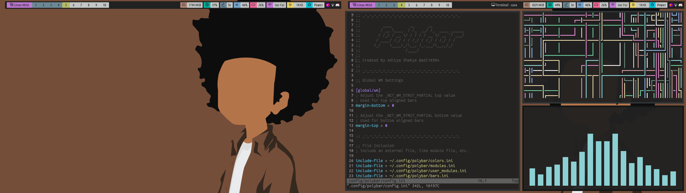

## BSPWM Dotfiles
Repository containing all my configuration files used to create my rice. Below an example of the final result.


---

### How to install

Dependencies
```sh
sudo apt install -y build-essential cmake cmake-data pkg-config libcairo2-dev libxcb1-dev libxcb-util0-dev libxcb-randr0-dev libxcb-composite0-dev python3-xcbgen xcb-proto libxcb-image0-dev libxcb-ewmh-dev libxcb-icccm4-dev libcurl4-openssl-dev libjsoncpp-dev libpulse-dev libmpdclient-dev libasound2-dev libxcb-cursor-dev libxcb-xrm-dev libxcb-xkb-dev libnl-genl-3-dev
```
Packages
```sh
$ sudo apt install -y bspwm sxhkd subversion rofi feh numlockx compton dunst neofetch imagemagick webp unifont gnome-terminal git
```

### Install polybar

```sh
$ sudo apt update
```
```sh
$ sudo apt install cmake cmake-data libcairo2-dev libxcb1-dev libxcb-ewmh-dev libxcb-icccm4-dev libxcb-image0-dev libxcb-randr0-dev libxcb-util0-dev libxcb-xkb-dev pkg-config python3-xcbgen xcb-proto libxcb-xrm-dev libasound2-dev libmpdclient-dev libiw-dev libcurl4-openssl-dev libpulse-dev
```
```sh
$ sudo apt install libxcb-composite0-dev && sudo apt install libjsoncpp-dev
$ sudo ln -s /usr/include/jsoncpp/json/ /usr/include/json
```
```sh
$ git clone https://github.com/polybar/polybar
```
```sh
$ cd polybar && ./build.sh
```
Be careful to type 'N' when the build asks if you want to download the example polybar configuration.

## Applying the settings
